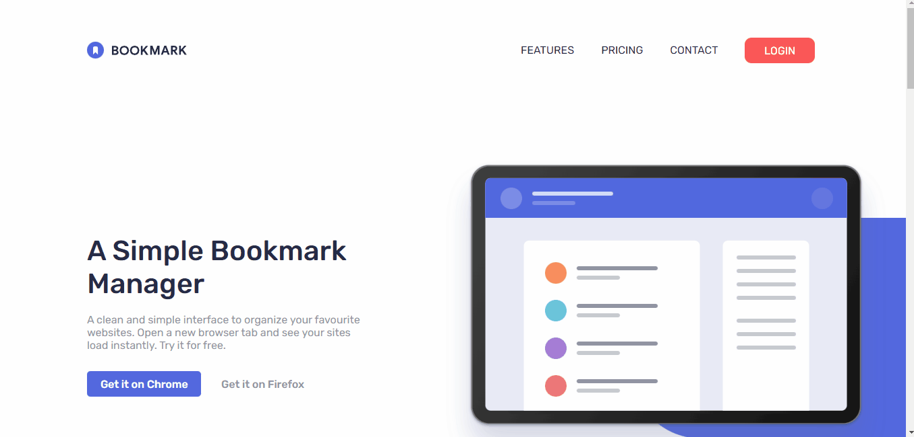
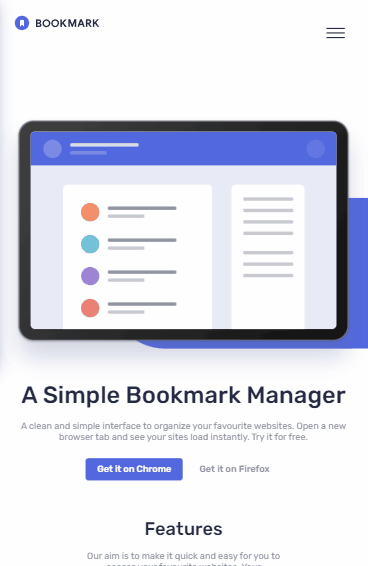

# Desafio Bookmark Landing Page - Frontend-Mentor

Este é um desafio de uma Landing Page para a Bookmark, proposto pelo site Frontend-Mentor.

## Tabela de Conteúdos

- [Visão Geral](#visão-geral)
    - [Imagens](#imagens)
    - [Link da página](#link)
- [Processo](#processo)
    - [Linguagens utilizadas](#linguagens-utilizadas)
    - [O que aprendi](#o-que-aprendi)
    - [Possíveis evoluções](#possíveis-evoluções)
- [Autor](#autor)

## Visão-geral

### Imagens

<br>

````
Versão de Desktop
````

   

<br>

````
Versão Mobile
````

 

### Link

- Página no GitHub Pages: <a href="https://julio-mansan2.github.io/bookmark-landing-page/">Clique aqui!</a>

## Processo

### Linguagens utilizadas

<br>

- Marcações semânticas de HTML5
- Propriedades de customização do CSS3
- Estruturas de JavaScript

<br>

### O que aprendi

<br>

- Criar uma navegação em "dropdown" utilizando JS:

````javascript

var acc = document.getElementsByClassName("acordeon");
var i;

for (i = 0; i < acc.length; i++) {
  acc[i].addEventListener("click", function() {
    this.classList.toggle("active");
    var panel = this.nextElementSibling;
    if (panel.style.maxHeight) {
      panel.style.maxHeight = null;
    } else {
      panel.style.maxHeight = panel.scrollHeight + "px";
    } 
  });
}

````

- Criar um menu hambúrguer:

````html

<input id="menu__toggle" type="checkbox" />
<label class="menu__btn" for="menu__toggle">
<span></span>
</label>

````
````css

    #menu__toggle {
        opacity: 0;
    }

    #menu__toggle:checked+.menu__btn>span {
        transform: rotate(45deg);
        background: var(--white);
    }

    #menu__toggle:checked+.menu__btn>span::before {
        top: 0;
        transform: rotate(0deg);
        background: var(--white);
    }

    #menu__toggle:checked+.menu__btn>span::after {
        top: 0;
        transform: rotate(90deg);
        background: var(--white);
    }

    .menu__btn {
        top: 7%;
        right: 7%;
        position: absolute;
        width: 2rem;
        height: 1rem;
        cursor: pointer;
        z-index: 2;
    }

    .menu__btn>span,
    .menu__btn>span::before,
    .menu__btn>span::after {
        display: block;
        position: absolute;
        width: 100%;
        height: 2px;
        background-color: var(--very-dark-blue);
        transition-duration: .25s;
    }

    .menu__btn>span::before {
        content: '';
        top: -8px;
    }

    .menu__btn>span::after {
        content: '';
        top: 8px;
    }

    .header .menu__box {
        position: absolute;
        top: 0;
        width: 100%;
        background: hsl(229, 31%, 21%, 0.95);
        box-shadow: 0 8px 32px 0 rgba(31, 38, 135, 0.37);
        backdrop-filter: blur(4px);
        -webkit-backdrop-filter: blur(4px);
        border-radius: 10px;
        border: 1px solid rgba(255, 255, 255, 0.18);
        left: -100%;
        padding: 5rem 1.8rem 1.8rem 1.8rem;
        align-items: center;
        flex-direction: column;
        transition-duration: .25s;
        text-align: center;
        z-index: 1;
    }

    .header .login-area {
        position: relative;
        flex-direction: column;
    }


````

- Mover a classe entre objetos

````Javascript

const simpleBookmarking = document.getElementById('simple-bookmarking')
const speedySearching = document.getElementById('speedy-searching')
const easySharing = document.getElementById('easy-sharing')
const simpleFeature = document.querySelector('.simple-bookmarking')
const speedyFeature = document.querySelector('.speedy-searching')
const easyFeature = document.querySelector('.easy-sharing')
const simpleLabel = document.querySelector('.simple-label')
const speedyLabel = document.querySelector('.speedy-label')
const easyLabel = document.querySelector('.easy-label')

simpleBookmarking.addEventListener('click', function () {
  if (simpleBookmarking.checked) {
    simpleFeature.classList.add('selecionado')
    speedyFeature.classList.remove('selecionado')
    easyFeature.classList.remove('selecionado')
    simpleLabel.classList.add('checked')
    speedyLabel.classList.remove('checked')
    easyLabel.classList.remove('checked')
  }
}
)

speedySearching.addEventListener('click', function () {
  if (speedySearching.checked) {
    simpleFeature.classList.remove('selecionado')
    speedyFeature.classList.add('selecionado')
    easyFeature.classList.remove('selecionado')
    simpleLabel.classList.remove('checked')
    speedyLabel.classList.add('checked')
    easyLabel.classList.remove('checked')
  }
}
)

easySharing.addEventListener('click', function () {
  if (easySharing.checked) {
    simpleFeature.classList.remove('selecionado')
    speedyFeature.classList.remove('selecionado')
    easyFeature.classList.add('selecionado')
    simpleLabel.classList.remove('checked')
    speedyLabel.classList.remove('checked')
    easyLabel.classList.add('checked')
  }
}
)

````
<br>

### Possíveis evoluções

<br>

- Códigos mais compactos;
- Utilizar menos medições manuais;
- Estilizar de forma mais correta o menu em hamburguer.

<br>

## Autor

GitHub - <a href="https://github.com/julio-mansan2">julio-mansan2</a> <br>
Front-end Mentor - <a href="https://www.frontendmentor.io/profile/julio-mansan2">julio-mansan2</a> <br>
LinkedIn - <a href="https://www.linkedin.com/in/j%C3%BAlio-a-mansan-3415a7249/">Júlio A.</a> <br>